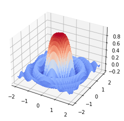
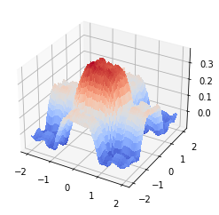
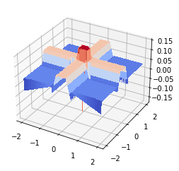
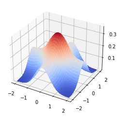

# Fuzzy-Estimator

We etimate a 2D-Sinc function using fuzzy models (Takagi-Sugeno, Sugeno, and Active Learing Method) and also the effect of noise on these model is revealed

## 2D-Sinc



## ALM

Estimation of 2D-Sinc using ALM



## Takagi-Sugeno

Estimation of 2D-Sinc using Takagi-Sugeno




## Sugeno 

Estimation of 2D-Sinc using Sugeno




## Results


```
+-----------------------------+
|  Model          |  Error    |
+-----------------------------+
|  ALM            |  0.05     |
+-----------------------------+
|  Takagi-Sugeno  |  0.13     |
+-----------------------------+
|  Sugeno         |  0.16     |
+-----------------------------+
```


